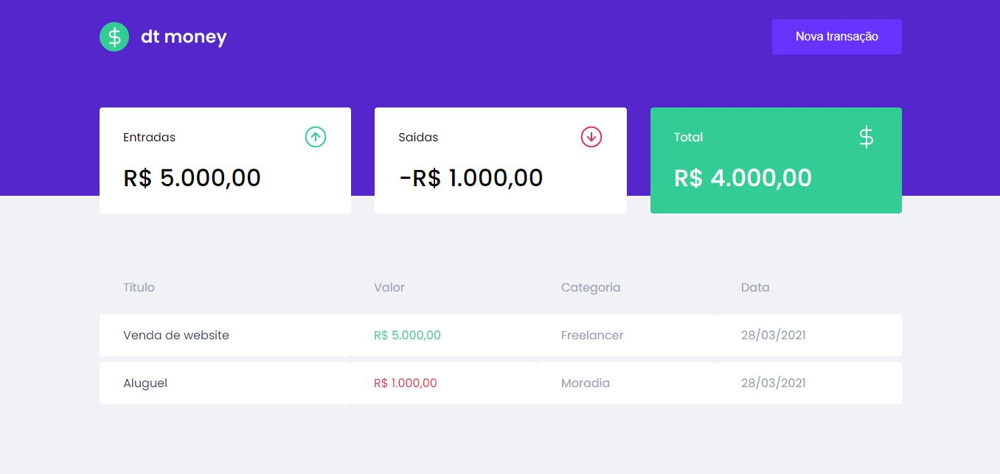
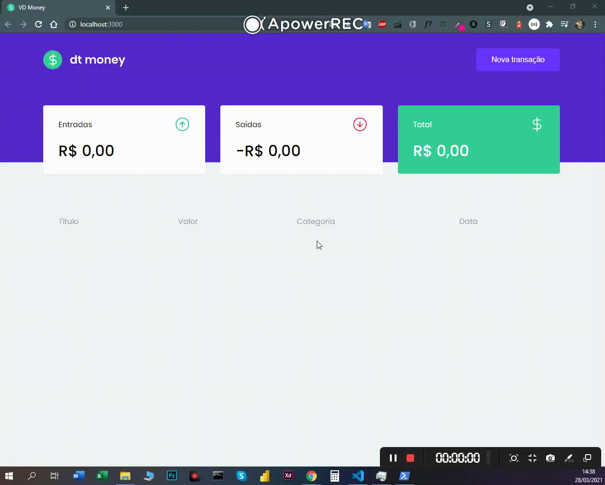

<h1 align="center">
Projeto dtMoney
</h1> 

<p>
   Screenshot da Página Principal
</p> 

<p align="center">
   
</p> 

<p>
   Demostração em video
</p> 

<p align="center">
   
</p> 

<p align="center">

   <a href="https://elastic-tesla-7c31c4.netlify.app/">Deploy</a>
</p> 

## Sobre

**dt money** foi um desafio criado no **Bootcamp Ignite**, o projeto consiste em fazer a gestão financeira em geral.


## Ferramentas

O projeto foi desenvolvido utilizando as seguintes tecnologias:

- **CSS3/SCSS**
- **TypeScript**
- **ReactJS**
- **MirageJS**


## Para iniciar

```bash

    # clone repository
    $ git clone https://github.com/ViniciusMDuarte/dt-money.git

    # Enter directory
    $ cd dt-money

    # Install package
    $ yarn
    
    # Start the project
    $ yarn dev

    # View browser
    $ http://localhost:3000/
```
